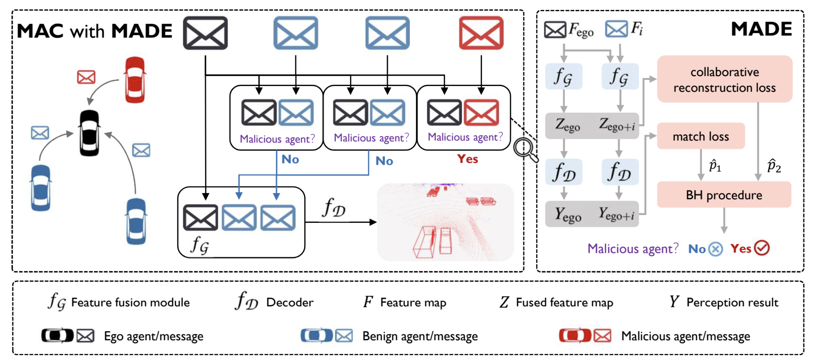

# MADE (IROS2024)

Malicious Agent Detection for Robust Multi-Agent Collaborative Perception

[Paper](https://arxiv.org/abs/2310.11901) | [Video](https://youtu.be/EmqhmzEQ0Y0?si=cGPx6TGaFasKTCbA) 

Recently, multi-agent collaborative (MAC) perception has been proposed and outperformed the traditional singleagent perception in many applications, such as autonomous driving. However, MAC perception is more vulnerable to adversarial attacks than single-agent perception due to the information exchange. The attacker can easily degrade the performance of a victim agent by sending harmful information from a malicious agent nearby. In this paper, we propose Malicious Agent Detection (MADE), a reactive defense specific to MAC perception that can be deployed by an agent to accurately detect and then remove any potential malicious agent in its local collaboration network. In particular, MADE inspects each agent in the network independently using a semi-supervised anomaly detector based on a double-hypothesis test with the Benjamini-Hochberg procedure for false positive control. For the two hypothesis tests, we propose a match loss statistic and a collaborative reconstruction loss statistic, respectively, both based on the consistency between the agent to be inspected and the ego agent deployed with our detector. We comprehensively evaluate MADE on a benchmark 3D dataset, V2X-sim, and a real-road dataset, DAIR-V2X, comparing it to baseline defenses. Notably, with the protection of MADE, the drops in the average precision compared with the best-case ‘Oracle’ defender are merely 1.27% and 0.28%, respectively.

## Installation and Data Preparation

Please visit the feishu docs MADE Installation Guide [Chinese Ver.](https://udtkdfu8mk.feishu.cn/wiki/Iz0zwkoMMiYkeAkehiVcaUYPndg?from=from_copylink) or [English Ver.](https://udtkdfu8mk.feishu.cn/wiki/JWYgwvKNciJS6lk55imcPuwZnqh?from=from_copylink) to learn how to install and run this repo. 

## How to Run the Codes?

### 1. DiscoNet - V2X-Sim 

---

#### a. Main Function: `test_attack_det.py`

##### Parameters:
- `--resume [model file]`
- `--detection_method [none | match_cost_v2 | residual_autoencoder_v2 | multi-test-v2 | robosac]`
    - Other parameters are experimental and no longer in use.
- `--attack [attack configuration YAML file, located in config/attack/, with the naming convention N{number of attackers}_E{epsilon size}_S{number of attack steps}. Attacks with shift have additional suffixes: _shift indicates a shift, _sep indicates a separate region shift and erase.]`
- `--log` 
    - Record results.
- `--logpath [path to save results]`
- `--att_subpath [subpath under logpath for attack methods. When using multi-test to load saved match cost and reconstruction loss, this path will be used to find the log files.]`
- `--visualization [save the coresponding pkl file for each frame]`

You can refer some existed scripts for experiments in `MADE/made_simulation/scripts`.

#### b. **Experimental Raw Results** 

recorded in `MADE/made_simulation/experiments`, here are some available names we use and you can change with what you prefer by using `--logpath`.

- `attack/` contains results for different attack parameters.
- `match_cost_v2/` contains results for match cost.
- `residual_ae_v2/` contains results for residual autoencoder.
- `multi_test_v3/` contains results for multi-test.
- `robosac/` contains results for baseline.

#### c. visualization

 	1. add `--visualization` when running test_attack_det.py
 	2. use `simple_draw` function in `result_analysis.py` to visualize each frame
 	3. use `img2video.py` to combine each frame into a continuous video

---

### 2. OpencoodV2 - DAIR-V2X

You can refer thr structure in `rubbish.sh`!

#### a. Main Function: `inference.py`

##### Parameters:

- `model_dir` [choose opencoodv2 model you want in logs, such as `logs/dair_centerpoint_multiscale_att_from_0`]
- `fusion_method` [only support intermediate]
- `dataset` [choose from train | validation | test ]
- `attack` [attack config file path]
- `temperature` [default choose 20]
- `range_dataset` [index range of dataset]
- `standard` [defense method you want to use, choose from match | robosac | ae. And you can also generate ML or CRL for dataset, see the example in rubbish.sh!]
- `ae_type` [if using ae as defense method you should also choose ae_type, `residual` is default]
- use `show_vis` and `save_vis` at the same time for visualization and it will save the images in `model_dir`

#### b. visualization

 	1. use `show_vis` and `save_vis` at the same time for visualization and it will save the images in `model_dir`
 	2. use `img2video.py` in folder `v2xsim_vistool` to combine each frame into a continuous video

## Checkpoints

### DiscoNet Checkpoints

Download [checkpoints_disconet.zip](https://drive.google.com/file/d/1TamrHNcIWz-IgQmvjXmw5JrCfMINvO5U/view?usp=sharing). Rename it as 'checkpoints' and put it in the  `MADE/made_simulation`.

### OpencoodV2 Checkpoints

When using opencoodV2 for DAIR-V2X, we train a multi-scale Where2comm with temperature 20 and 18 epochs. The temperature will influence the  degree of fusion with other agents and its original value is 1. We provide checkpoints in these two occasions and you can also set other temperature value and train from scratch.

Download [temp_0_net_pth](https://drive.google.com/file/d/1FF9Te3-RpfQo0XAnGyIHzyhUOPkvNPr5/view?usp=sharing) and save it to `MADE/made_real/logs/dair_centerpoint_multiscale_att`

Download [temp_20_net_pth](https://drive.google.com/file/d/1ras2T5-rqO7qgKZqdRMOCWMcwYfd76d3/view?usp=sharing) and save it to `MADE/made_real/logs/dair_centerpoint_multiscale_att_from_0`

## Acknowlege

This project is impossible without the code of [OpenCOOD](https://github.com/DerrickXuNu/OpenCOOD)! 

 
